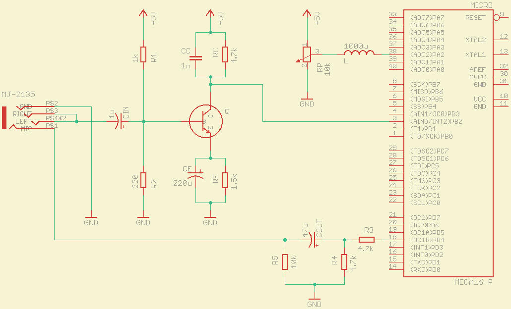

# Atmega16 Modem

You can connect to smart devices such as iPhones, Android, or laptops via the headphone jack with this library. You can find more information [here](https://micromodem.ml/#/guide).

## Resource Usage

This library requires the following microcontroller resources to work:
- Timer 1: Frequency timing
  + Timer 1A: for timing the received frequencies
  + Timer 1B: for timing the transmitted frequencies
- PB2 (AIN0): The frequency input port of the speaker bus
- PA2 (ADC2): Constant voltage input port for comparison with input frequency voltage
- PD4 (OC1B): Output frequency port to the microphone bus
- Timer 1 Input Capture Interrupt
- Timer 1 Compare Match Interrupt A
- Timer 1 Compare Match Interrupt B

## Usage

In this code example, we echo the incoming messages back to the smart device.

```c
#include <avr/io.h>
#include <avr/interrupt.h>
#include <modem.h>

void on_receive_msg(const char *msg, uint8_t size) {
	modem_snd_async(msg, size);
}

int main(void) {
	sei();
	modem_lsn(on_receive_msg);
	while(1);
}
```

## Schematic



## License

The project is licensed under the GPLv3.